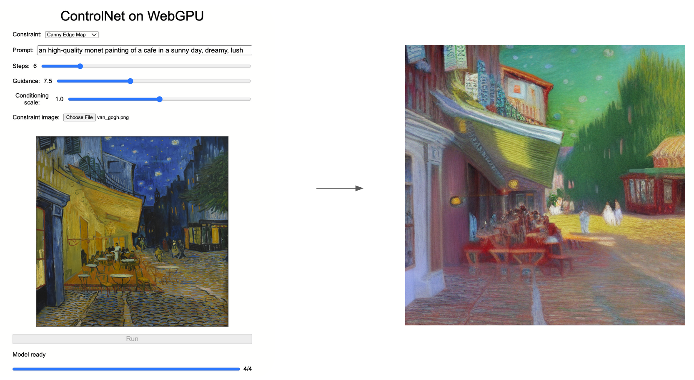
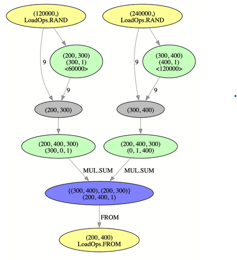

# control.net

By Zhiyu Lei, Gene Liu, and Jason Xie

This is an implementation of [ControlNet](https://github.com/lllyasviel/ControlNet) in the browser powered by WebGPU.

This project makes use of the tinygrad deep learning framework and its machine learning compilation capabilities to compile a custom tinygrad ControlNet implementation to WebGPU compute shaders. A simple frontend enables users to input prompts and constraints to access the constructed compute pipelines.

Note that the generated compute shaders are not necessarily optimized. The implementation here demonstrates various compiler and shader level optimizations that improve model performance on the GPU.

## Project Structure

This project is consisted of the following submodules:

### TinyGrad

The tinygrad submodule contains a fork of the tinygrad deep learning framework. The module includes the custom ControlNet implementation and the dependant web control net frontend, compiler, and shaders. The core web control net code is located [here](./tinygrad/examples/webgpu/controlnet/). A fork is used rather than the original repository in order to ensure compatibility with tinygrad dependencies.

### WebGPU Flash Attention

The WebGPU flash attention module includes a custom implementation of [FlashAttention](https://arxiv.org/abs/2205.14135) in WebGPU. The implementation will be used to optimize the WebGPU ControlNet model.

## What is ControlNet?

[ControlNet](https://github.com/lllyasviel/ControlNet) is an extension of Stable Diffusion models where an additional user constraint is used to influence the final result. It trained via curating image-text-image triples for various constraints and then fine-tuning a neural network to inject context to Stable Diffusion. The original ControlNet introduces model weights for a variety of constraints, such as Canny edge maps, depth/normal maps, human poses, or even scribbles.

## WebGPU Model Porting

To construct a functional ControlNet model using WebGPU, the following general steps are taken:

### tinygrad Implementation and MLC

The original ControlNet implementation is written in PyTorch. A corresponding tinygrad implementation is written to make use of tinygrad's MLC capabilities.

Machine learning compilation (MLC) allows for machine learning models written in higher level languages such as Python to be converted to equivalent representations in other languages and frameworks. In this case, we use the abstract syntax tree of a tinygrad model and convert each component into a separate kernel. The kernels are combined to form full modules through WebGPU compute pipelines.

### WebGPU Model Weight Loading

The above step produces a set of WebGPU compute pipelines, with each compute shader requiring the matching weight buffer of the model to be loaded as input. These weight buffers are extracted from huggingface safetensors files. As these weights are quite large(~5.5 GB) and exceed the v8 JavaScript engine heap size limit, the weights are directly loaded into GPU buffers in chunks.

### Frontend

A simple frontend allows users to interact with the ControlNet model. [OpenCV.js](https://docs.opencv.org/3.4/d5/d10/tutorial_js_root.html) is used to process user input images and convert them to the appropriate format for the model.

## Optimizations

### CPU Pipeline Compute Pass

### F16 Model Weights and Inputs

## Performance Analysis

TBD

## Usage

TBD

## References

[ControlNet](https://github.com/lllyasviel/ControlNet)

[Web LLM](https://github.com/mlc-ai/web-llm)

[Web Stable Diffusion](https://github.com/mlc-ai/web-stable-diffusion)

[tinygrad](https://github.com/tinygrad/tinygrad)
