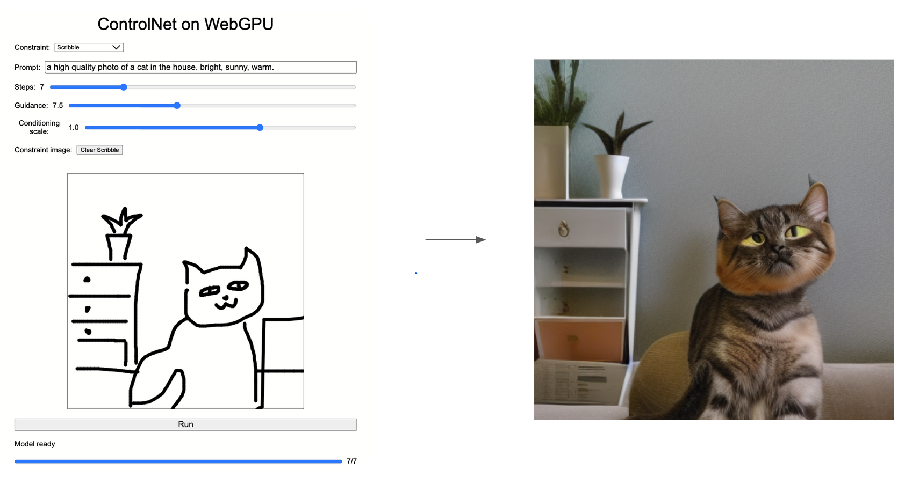

# control.net

By [Zhiyu Lei](https://www.linkedin.com/in/zhiyu-lei/), [Gene Liu](https://www.linkedin.com/in/gene-l-3108641a3/), and [Jason Xie](https://www.jchunx.dev)

This is an implementation of [ControlNet](https://github.com/lllyasviel/ControlNet) in the browser powered by WebGPU. It includes support for the Canny edge and scribble constraint image variants.

This project makes use of the tinygrad deep learning framework and its machine learning compilation capabilities to compile a custom tinygrad ControlNet implementation to WebGPU compute shaders. A simple frontend enables users to input prompts and constraints to access the constructed compute pipelines.

Note that the generated compute shaders are not necessarily optimized. The implementation here demonstrates various compiler and shader level optimizations that improve model performance on the GPU.

## Project Structure

This project is consisted of the following submodules:

### TinyGrad

The tinygrad submodule contains a fork of the tinygrad deep learning framework. The module includes the custom [ControlNet implementation](https://github.com/JChunX/tinygrad/blob/59bb118b170a51f4276a04c158088e35830c2070/examples/controlnet.py) and the dependant web control net frontend, compiler, and shaders. The core web control net code is located [here](https://github.com/JChunX/tinygrad/tree/web-control-net/examples/webgpu/controlnet). A fork is used rather than the original repository in order to ensure compatibility with tinygrad dependencies. The actual web control net can be run independentally of tinygrad, but as it is important towards the compute shader geneartion, it is included as a submodule.

### WebGPU Flash Attention

The WebGPU flash attention module includes a custom implementation of [FlashAttention](https://arxiv.org/abs/2205.14135) in WebGPU. The implementation acts as a proof of concept for optimizing the WebGPU ControlNet model due to the several multi headed attention layers within the underlying stable diffusion, control net backbone, and text models. Due to timeframe constraints, the implementation is not fully integrated into the WebGPU ControlNet model, but the code is included for future work.

## What is ControlNet?

[ControlNet](https://github.com/lllyasviel/ControlNet) is an extension of Stable Diffusion models where an additional user constraint is used to influence the final result. It is trained via curating image-text-image triples for various constraints and then fine-tuning a neural network to inject context to Stable Diffusion. The original ControlNet introduces model weights for a variety of constraints, such as Canny edge maps, depth/normal maps, human poses, or even scribbles.

The ControlNet model consists of 3 main components: a text encoder, a diffusion UNet and scheduler, and finally an image decoder. The text encoder operates on the input prompt to produce token embeddings, the diffuser iteratively removes noise from a randomly generated image to produce a final image representation with the constraint image input, and the image decoder produces the final image from the diffused image representation. More details on architecture can be found in the [original paper](https://arxiv.org/abs/2302.05543).

## WebGPU Model Porting

To construct a functional ControlNet model using WebGPU, the following general steps are taken:

### tinygrad Implementation and MLC

The original ControlNet implementation is written in PyTorch. A corresponding tinygrad implementation is written to make use of tinygrad's MLC capabilities.

Machine learning compilation (MLC) allows for machine learning models written in higher level languages such as Python to be converted to equivalent representations in other languages and frameworks. In this case, we use the abstract syntax tree of a tinygrad model and convert each component into a separate kernel. The kernels are combined to form full modules through WebGPU compute pipelines.

### WebGPU Model Weight Loading

The above step produces a set of WebGPU compute pipelines, with each compute shader requiring the matching weight buffer of the model to be loaded as input. These weight buffers are extracted from huggingface safetensors files. As these weights are quite large(~5.5 GB for f32 weights) and exceed the v8 JavaScript engine heap size limit, the weights are directly loaded into GPU buffers in chunks.

### Frontend

A simple frontend allows users to interact with the ControlNet model. [OpenCV.js](https://docs.opencv.org/3.4/d5/d10/tutorial_js_root.html) is used to process user input images and convert them to the appropriate format for the model.

## Optimizations

### CPU Pipeline Compute Pass

The custom compiler script used to generate the WebGPU pipelines was initially written to separate each encoding of each generated shader in their individual pipelines. This introduced significant CPU overhead in managing the spinup and shutdown of each compute shader pipeline.

To reduce this overhead the encoding was combined into a singular dispatch within a longer compute pass. This enabled higher GPU uptime and less overhead in the overall model execution pass, reducing general runtimes.

Note that this optimization is not included within the final model due to the instability of long passes in WebGPU corrupting input and intermediary data. After getting in contact with the WebGPU team it seems that this issue could be due to a WebGPU mismanagement of internal barriers creating race conditions on GPU buffer reading and writing.

### F16 Model Weights and Inputs

A common optimization for machine learning models is to reduce the precision within the weights and inputs to approximate the former model at lower granularity. The original ControlNet utilizes 32 bit floating point weights and inputs, but by reducing the precision theoretically the model can be run faster with minimal loss in accuracy. To implement this optimization, the original model weights are converted to 16 bit floating point numbers and the inputs are downsampled to 16 bit floating point numbers.

Floating point overflow was an issue that arose during this optimization. While the model weights themselves never exceeded the range of 16 bit floating point numbers(the max being around 50,000), several layers of weight operations with intermediate values would eventually produce values that overflow the float16 range. An attempt to subvert this included downscaling all inputs and upscaling the outputs by some constant factor.

In the future, more distinction can be made between different components of the model. For example, the authors of CLIP, the text encoder used within ControlNet, recommend using float32 to avoid accuracy loss, and so different configurations of float16 and float32 model components can be tested to find the optimal balance between speed and accuracy.

### Flash Attention

Flash Attention is a mechanism of computing multi headed attention by breaking the input matrices into several parts in order to feed into SRAM of GPU with higher speed but limited memory. Unfortunately, WebGPU might not support SRAM, but using Flash Attention can still increase the space efficiency of computation.

## Performance Analysis

### Per step diffusion latency

The graph shows that switching to a fp16 model drastically reduces the latency of the model. But fp16 model stability is left to be desired.

## Usage

> Warning! This project is tested and verified to work on Chrome 120+ and Apple Silicon due to their SoC architecture and unified memeory. Other browsers and hardware may see differing results due to the large model weights and memory requirements.

This project was tested with `npx`. To install `npx` run:

`npm install -g npx`

To run the website locally, first clone the web control net directory within the tinygrad submodule [here](https://github.com/JChunX/tinygrad/tree/web-control-net/examples/webgpu/controlnet). Download the weight files of the model variants from the following links:

[f32 canny](https://www.dropbox.com/scl/fi/6yhpbdqf7q9xvyhkhqg0h/net_canny.safetensors?rlkey=rz9vrb0a3gz2lvomtqbb1j6cw&dl=0)

[f32 scribble](https://www.dropbox.com/scl/fi/ka2gca8qwucmhi8z8ezo9/net_scribble.safetensors?rlkey=tyoo7fgen92l54i72sv14ounm&dl=0)

[f16 canny](https://www.dropbox.com/scl/fi/uoc4c04wvjeied32mzg9z/net_f16_canny.safetensors?rlkey=g6su0zwhky07j8suhivh3gllr&dl=0)

[f16 scribble](https://www.dropbox.com/scl/fi/3rr6qdt0y13f1hcgl0sfs/net_f16_scribble.safetensors?rlkey=55n5g3uokgjufum0gibur5p1s&dl=0)

Within the cloned directory run:

`npx http-server`

to launch the web server and navigate to the provided URL in Chrome to access the webpage.

## References

[ControlNet](https://github.com/lllyasviel/ControlNet)

[Web LLM](https://github.com/mlc-ai/web-llm)

[Web Stable Diffusion](https://github.com/mlc-ai/web-stable-diffusion)

[tinygrad](https://github.com/tinygrad/tinygrad)

## Project Documents

[Project Pitch](https://docs.google.com/document/d/1SE9JiwvdWxYVsqpN36UzVU4ws0QDpKga8wy8crXqA4c/edit?usp=sharing)

[Milestone 1](https://docs.google.com/presentation/d/1Vf-wrlGaSTEg70Q1_Nhrf4q0B0zB16FOnlzuG_aslG8/edit?usp=sharing)

[Milestone 2](https://docs.google.com/presentation/d/1DbnoB_UA1c14cnKGCzre-AEKE0ZIKlSKxsXFPUu49xU/edit?usp=sharing)

[Milestone 3](https://docs.google.com/presentation/d/15Ltc72DwljB1aK2Xp6cXSzhIKfnR7CSHOmv9KKrQDtI/edit?usp=sharing)

[Final Presentation](https://docs.google.com/presentation/d/1GWn1dx45-bvxsy_yqhdAQ1i2YqoHtIAGxQvhNggjQeQ/edit?usp=sharing)
